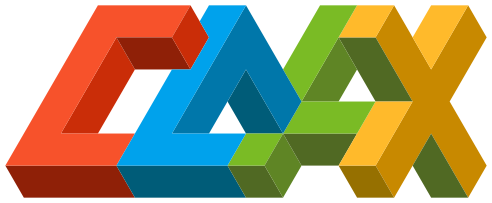

[](https://github.com/microsoft/coax/actions?query=workflow%3Atests)
[](https://badge.fury.io/py/coax)
[](https://coax.readthedocs.io/en/latest/)

# coax

*Plug-n-Play Reinforcement Learning in Python with [OpenAI Gym](https://gym.openai.com/) and [JAX](https://jax.readthedocs.io/)*


Create simple, reproducible RL solutions with JAX function approximators.


## Documentation

[](https://coax.readthedocs.io/)

For the full documentation, including many examples, go to
[coax.readthedocs.io](https://coax.readthedocs.io/).


## Install

**coax** is built on top of JAX, but it doesn't have an explicit dependence on the `jax` python
package. The reason is that your version of `jaxlib` will depend on your CUDA version. To install
without CUDA, simply run:

```bash
$ pip install jaxlib jax coax --upgrade

```

If you do require CUDA support, please check out the
[Installation Guide](https://coax.readthedocs.io/examples/getting_started/install.html).


## Getting Started

Have a look at the
[Getting Started](https://coax.readthedocs.io/examples/getting_started/index.html) page to train
your first RL agent.


## Contributing

This project welcomes contributions and suggestions.  Most contributions require you to agree to a
Contributor License Agreement (CLA) declaring that you have the right to, and actually do, grant us
the rights to use your contribution. For details, visit https://cla.opensource.microsoft.com.

When you submit a pull request, a CLA bot will automatically determine whether you need to provide a
CLA and decorate the PR appropriately (e.g., status check, comment). Simply follow the instructions
provided by the bot. You will only need to do this once across all repos using our CLA.

This project has adopted the
[Microsoft Open Source Code of Conduct](https://opensource.microsoft.com/codeofconduct/). For more
information see the [Code of Conduct FAQ](https://opensource.microsoft.com/codeofconduct/faq/) or
contact [opencode@microsoft.com](mailto:opencode@microsoft.com) with any additional questions or
comments.
